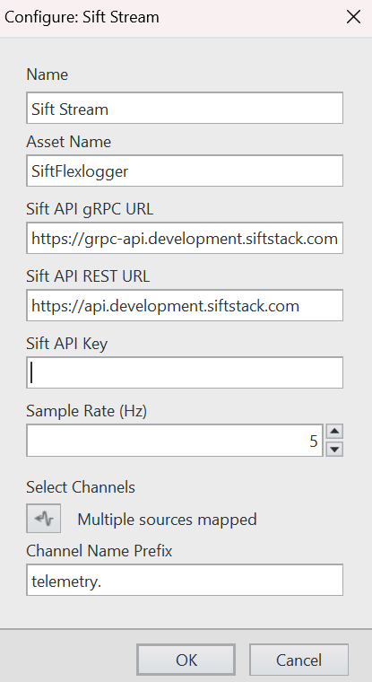

# FlexLogger Sift Stream Plug-in

This plug-in streams live data from Flexlogger to Sift.

## Supported versions of FlexLogger:

2024 Q4 and above

## Getting Started

- Copy the content of the Sift Stream build folder in `C:\Users\Public\Documents\National Instruments\FlexLogger\Plugins\IOPlugins\Sift Stream`
- Launch FlexLogger
- Configure some channels
- Add theSift Stream plug-in by selecting Add channels>>Plug-in>>Sift Stream
- Click the configure (gear) button on the right hand side of the plug-in.
- Fill out the plug-in settings

### Configuration Options

- **Asset Name** - The name of the Sift asset to stream to.
- **Sift API gRPC URL** - This can be found in Sift UI>>Manage>>API Keys
- **Sift API REST URL** - This can be found in Sift UI>>Manage>>API Keys
- **Sift API Key** - API Key to use for requests. One can be created at Sift UI>>Manage>>API Keys
- **Sample Rate (Hz)** - The sample rate to stream all channels at. Generally, a lower value than the source data rates used in Flexlogger (See the TDMS upload plugin for full rate upload).
- **Select Channels** - Opening this will select the channels to stream from Flexlogger to Sift.
- **Channel Name Prefix** - In order to differentiate channels that are uploaded by TDMS and streamed, this prefix will be applied to the channel names on streaming. By default, this is `telemetry.`.

#### Using Environment Variables

To speed up configuration of both the Sift Stream and Sift TDMS Uploader plug-ins, the following Windows Environment variables can be set to automatically load when the plugin is added to the project:

- SIFT_API_GRPC_URL
- SIFT_API_REST_URL
- SIFT_API_KEY

### Logging

Errors and other informational messages are logged to files in the `C:\Users\Public\Documents\National Instruments\FlexLogger\Plugins\IOPlugins\Sift Stream` directory. 

## Support

Please report any problem by filing an issue in github.
https://github.com/sift-stack/sift-labview
