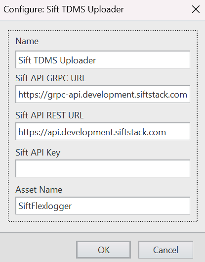

# FlexLogger Sift TDMS Uploader Plug-in

This plug-in streams live data from Flexlogger to Sift.

## Supported versions of FlexLogger:

2024 Q4 and above

## Getting Started

- Copy the content of the Sift Stream build folder in `C:\Users\Public\Documents\National Instruments\FlexLogger\Plugins\IOPlugins\Sift TDMS Uploader`
- Launch FlexLogger
- Configure some channels
- Add theSift Stream plug-in by selecting Add channels>>Plug-in>>Sift TDMS Uploader
- Click the configure (gear) button on the right hand side of the plug-in.
- Fill out the plug-in settings

Once a TDMS file is generated in Flexlogger (by using the Run and Stop Run buttons), it will automatically be uploaded to Sift.

### Configuration Options

- **Asset Name** - The name of the Sift asset to upload to.
- **Sift API gRPC URL** - This can be found in Sift UI>>Manage>>API Keys
- **Sift API REST URL** - This can be found in Sift UI>>Manage>>API Keys
- **Sift API Key** - API Key to use for requests. One can be created at Sift UI>>Manage>>API Keys

The **Run Name** of the uploaded data is the same name of the TDMS file. To change the Run Name, the TDMS file name configuration may be changed in the Logging Specification tab in Flexlogger.

#### Using Environment Variables

To speed up configuration of both the Sift Stream and Sift TDMS Uploader plug-ins, the following Windows Environment variables can be set to automatically load when the plugin is added to the project:

- SIFT_API_GRPC_URL
- SIFT_API_REST_URL
- SIFT_API_KEY

### Logging

Errors and other informational messages are logged to files in the `C:\Users\Public\Documents\National Instruments\FlexLogger\Plugins\IOPlugins\Sift Stream` directory. 

## Support

Please report any problem by filing an issue in github.
https://github.com/sift-stack/sift-labview
